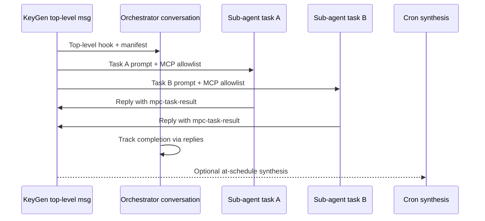

# Agent hooks — user guide

This guide explains how to use **inbound webhooks**, **KeyGen `@agent` messaging**, **Plan mode**, and **multi-task orchestration** on an mpc-auth node. It is written for operators and integrators.

For HTTP API field names and auth rules, see **[`docs/references/API_IMPLEMENTATION.md`](references/API_IMPLEMENTATION.md)** (Agent hooks) and **[`docs/references/API_KEYGEN_MESSAGING.md`](references/API_KEYGEN_MESSAGING.md)**. Bundled templates live under **`agent_llm_config.defaults/hooks/`** in this repo and are copied into runtime **`agent_llm_config/hooks/`** beside your node’s **`configs.yaml`** by **`process_config.sh`** (once per file if missing).

---

## What agent hooks do

Agent hooks wake the node’s **automated agent** (same engine as cron jobs: LLM + MCP tools, no interactive elicitation). Three triggers exist:

| Trigger | Source | Typical use |
|---------|--------|-------------|
| **Inbound webhook** | External system `POST`s to your node | GitHub, Stripe, Slack, Telegram, custom scripts |
| **KeyGen `@agent` message** | `POST /sendMessage` or peer via MQTT | Coordinate across MPC nodes; simple one-shot automation |
| **Orchestration** | Top-level KeyGen message with `mpc-orchestrate v1` | Several parallel sub-agents, optional synthesis cron |

```mermaid
flowchart TB
  subgraph external [External]
    WH[Webhook POST]
    TG[Telegram Bot API]
  end
  subgraph node [mpc-auth node]
    IN[/hooks/inbound/id]
    KG[KeyGen channel]
    AG[runAgentChatTurn]
  end
  WH --> IN --> AG
  TG --> IN
  KG -->|@agent simple| AG
  KG -->|@agent + manifest| ORCH[Orchestrator + sub-agents]
  ORCH --> AG
```

**Important:** KeyGen hooks run **inside the node** when messages arrive. You do **not** need a separate poll script on a schedule.

---

## Before you start

### Enable hooks and provision files

1. In **`configs.yaml`** (from **`configs-original.yaml`**), ensure:

   ```yaml
   EnableAgentHooks: true
   EnableMcpChat: true
   ```

   Optional (defaults shown):

   ```yaml
   AgentHookListenAddr: 127.0.0.1
   AgentHookListenPort: 18090
   ```

2. Run **`process_config.sh`** (or **`scripts/provision-node.sh`**) so bundled hook files are copied into **`agent_llm_config/hooks/`** next to **`configs.yaml`** (existing files are not overwritten).

3. **Restart mpc-auth** after changing hook config or adding webhooks (same pattern as MCP/cron updates in the node app).

4. Configure the **agent LLM** (provider, model, API key) and **MCP servers** (e.g. **continuum**) in the node UI or via **`POST /agentLlmConfig`** / Variables.

### Secrets and Variables

Webhook signing secrets are **never** stored in `webhooks.json`. Each webhook uses a Variables entry:

- **`WEBHOOK_SECRET_<WEBHOOK_NAME>`** — e.g. `WEBHOOK_SECRET_GITHUB_EVENTS` for webhook name `github_events`
- **`TELEGRAM_BOT_TOKEN`** — required for Telegram **replies** (separate from the webhook secret)

Set values in **AI Agent → Variables** or **`POST /addEnvironmentVariable`**. On first load, mpc-auth can auto-generate placeholder webhook secrets; replace them with real provider secrets before going live.

### Inbound URL (webhooks only)

mpc-auth exposes inbound webhooks on a **dedicated HTTP listener**, separate from management (**8080** / **8081**) and from **Browser HTTPS** (**8443**, self-signed cert for the dashboard).

| Listener | Default bind | Purpose |
|----------|--------------|---------|
| **Hook inbound** | **`127.0.0.1:18090`** | `POST /hooks/inbound/{webhookId}` only |
| **Browser HTTPS** | **`:8443`** (all interfaces when enabled) | Dashboard read JWT (`GET`); **not** webhook ingress |
| **Browser loopback read** | **`127.0.0.1:8445`** | SSH-tunnel attach in the app |
| **Management API** | Usually **8080** / **8081** | Operator API; webhook CRUD, not provider POST target |

**There is no built-in public webhook URL** on a stock node. The Webhooks tab shows the real target:

```http
http://127.0.0.1:18090/hooks/inbound/{webhookId}
```

That address is correct **on the server** (or via an SSH `-L` forward for **your** testing). GitHub, Stripe, and Telegram **cannot** call it from the internet unless **you** add exposure (below). They also **cannot** use **`https://<node>:8443/hooks/inbound/...`** by default — that port serves the **browser API** with a **self-signed** certificate, and webhook routes are **not** registered there.

#### What is not automatic (Browser HTTPS / self-signed cert)

- **Browser HTTPS** (`configs.yaml` → `BrowserHTTPS`) uses the node’s **self-signed** `browser.crt` so **you** can trust it in the browser after importing the cert (continuumdao-node-app → **Fetch Self-Signed Web Cert**). That path is for **operator attach + JWT**, not for provider webhooks.
- Providers that require **publicly trusted HTTPS** (GitHub, Stripe, Telegram `setWebhook`, etc.) will **reject** `https://your-node:8443/...` with a self-signed cert unless you terminate TLS elsewhere with a **CA-backed** certificate (Let’s Encrypt, commercial CA, or a tunnel provider’s hostname).
- mpc-auth does **not** ship nginx, Let’s Encrypt, or a second TLS vhost for **18090**. **`your-proxy`** in examples means **whatever URL you configure** to reach `http://127.0.0.1:18090` — not the attach URL from the app.

#### How to expose webhooks (choose one)

| Approach | When to use | What you put in GitHub / Stripe / Telegram as **`your-proxy`** |
|----------|-------------|----------------------------------------------------------------|
| **A. Relay / forwarder** (recommended if the node has no public TLS) | Same pattern as **Gmail** / **Proton** in this guide | The relay’s **HTTPS** URL (e.g. `https://hooks.mycompany.com/...`). The relay `POST`s to the node with `Authorization: Bearer <WEBHOOK_SECRET_*>` to `http://<node-private-ip>:18090/hooks/inbound/<id>` over VPN, LAN, or SSH from the relay host. |
| **B. Tunnel on the node** | Dev / small deployments | Tunnel URL, e.g. `https://abc123.ngrok-free.app` → `http://127.0.0.1:18090` (ngrok, Cloudflare Tunnel, Tailscale Funnel). |
| **C. Reverse proxy + CA cert on the node** | Production on a VPS | `https://node.example.com/hooks/inbound/<id>` where **nginx/Caddy** on **443** (Let’s Encrypt) proxies to **`127.0.0.1:18090`**. You install and renew certs; mpc-auth stays on loopback **18090**. |
| **D. Local / same-host only** | Testing, cron, scripts on the node | `http://127.0.0.1:18090/hooks/inbound/<id>` — use **`POST /runWebhook`** in the UI or `curl` on the server. |
| **E. SSH `-L` on your laptop** | Debug only | `http://127.0.0.1:18090` **on your PC** after `ssh -L 127.0.0.1:18090:127.0.0.1:18090 user@node`. **Not** a GitHub webhook URL. |

**Minimal nginx on the node** (option C; Let’s Encrypt on **443** in front of this `location`):

```nginx
location /hooks/inbound/ {
    proxy_pass http://127.0.0.1:18090/hooks/inbound/;
    proxy_set_header Host $host;
    proxy_set_header X-Forwarded-For $proxy_add_x_forwarded_for;
}
```

#### Attach URL in the app (not the provider webhook URL)

**continuumdao-node-app** only controls how **your browser** reaches mpc-auth. None of these are valid **GitHub webhook Payload URLs** without extra exposure (table above):

| Attach mode | What you enter in the app | Relation to webhooks |
|-------------|---------------------------|----------------------|
| **Browser HTTPS** + JWT | Public host → app uses **`https://<host>:8443`** (self-signed) | Use for the dashboard only. For providers, use **A/B/C** — not `:8443` unless you manually proxy `/hooks/inbound/` → **18090** with a **CA-trusted** cert in front. |
| **SSH tunnel** + JWT | **`http://127.0.0.1:8445`** locally + **Public node IP/hostname** for `ssh` | Tunnel carries **browser** traffic to **8445**. Providers still need **A/B/C**; optional **E** for local `curl`. See [SSH tunnel attach](#ssh-tunnel-attach-127001) below. |
| **Plain HTTP** on the node | **`http://127.0.0.1:8080`** | **D**: `curl` / **runWebhook** to **`http://127.0.0.1:18090`**. Internet providers need **A/B/C**. |
| **Plain HTTP** + SSH to management | **`http://127.0.0.1:8080`** on laptop + public SSH host | Same as SSH row. |

#### Placeholder in examples

When docs say:

```http
POST https://your-proxy/hooks/inbound/{webhookId}
```

**`your-proxy`** is the **origin you chose in the exposure table** (relay hostname, tunnel URL, or Let’s Encrypt vhost) — **not** the Browser HTTPS attach host, and **not** `127.0.0.1` on your laptop unless you are only testing locally.

#### SSH tunnel attach (`127.0.0.1`)

When you choose **SSH tunnel** in the node app, your browser uses **`http://127.0.0.1:<local-port>`** (default **8445** on your PC, forwarded to the node’s **BrowserLoopbackReadHTTP** port). That is **plain HTTP** protected by **SSH**, not by the node’s self-signed **Browser HTTPS** cert on **8443**.

| Action | Works over SSH tunnel attach? | HTTPS required? |
|--------|------------------------------|-----------------|
| **Add / edit / enable webhooks** in the UI (`POST /addWebhook`, etc.) | **Yes** — management POSTs go through the tunnel to the same API as Browser HTTPS; you sign with Ed25519 / NodeMgtKey (no JWT on those POSTs). | **No** for the app — `http://127.0.0.1:8445` is enough. |
| **List webhooks**, agent chat, cron reads | **Yes** — needs your **read JWT** (same as Browser HTTPS attach). | **No** in the browser — still `http://127.0.0.1:…`. |
| **Set Variables** (`TELEGRAM_BOT_TOKEN`, `WEBHOOK_SECRET_*`) | **Yes** | **No** |
| **`POST /runWebhook`** (test) | **Yes** | **No** |
| **Telegram (or GitHub/Stripe) calling your node** | **Not via the attach URL alone** — Telegram’s servers are not on your laptop and cannot use `127.0.0.1:8445` or the SSH tunnel. | **Yes** for Telegram — you still need [exposure on the node](#how-to-expose-webhooks-choose-one) (**tunnel**, **relay**, or **nginx + CA cert** → `127.0.0.1:18090`). Then `setWebhook` uses that **public HTTPS** URL, not `http://127.0.0.1:8445`. |
| **Telegram bot replies** (`sendMessage`) | Works once inbound events arrive and **`TELEGRAM_BOT_TOKEN`** is set — outbound from the **node** to `api.telegram.org`, not through your browser. | N/A (outbound HTTPS to Telegram). |

**Practical split:** use SSH tunnel for **operating** the node (webhooks tab, variables, agent). Use a **separate** public HTTPS path to **18090** on the **server** for **Telegram / GitHub / Stripe** to deliver events. Optional: add `-L 127.0.0.1:18090:127.0.0.1:18090` to your `ssh` command only to **`curl` test** the hook URL on your PC — that still does **not** give Telegram a URL it can call unless you also run something like ngrok on that local port.

Authenticate inbound calls with one of:

- `Authorization: Bearer <WEBHOOK_SECRET_…>`
- `X-Mpc-Auth-Hook-Token: <WEBHOOK_SECRET_…>`
- Provider-specific headers (GitHub, Stripe, Slack, Telegram — see per-type sections below)

---

## Managing webhooks (UI and API)

### Webhooks tab (continuumdao-node-app)

1. Open **AI Agent → Webhooks**.
2. Built-in templates appear after restart (`generic_inbound`, `github_events`, `gmail_inbox`, `proton_inbox`, `stripe_events`, `slack_events`, `telegram_updates`) — usually **disabled** until configured.
3. **Add webhook** — choose **type**, set **name** (lowercase `a-z`, digits, `-`, `_`), edit **prompt**, enable when ready.
4. Copy **inbound URL** (`http://127.0.0.1:18090/…` on the node) and **secret variable**; set the secret in **Variables**. For internet providers, set up [exposure](#how-to-expose-webhooks-choose-one) first — the tab URL is not enough by itself.
5. Use **Run** for a test payload, **Activate/Deactivate** without deleting, **Restart node** when prompted after add/update.

### API equivalents

| Action | Method |
|--------|--------|
| List | `GET /listWebhooks` (JWT on Browser HTTPS when applicable) |
| Detail + inbound URL | `GET /getWebhookById?id=` |
| Create | `POST /addWebhook` (management signature) |
| Edit prompt/type | `POST /updateWebhook` |
| Enable/disable | `POST /activateWebhook` / `POST /deactivateWebhook` |
| Test | `POST /runWebhook` |
| Delete | `POST /removeWebhook` |

Each webhook keeps **one agent conversation** (`conversationId`). History accumulates across events until you delete that conversation in the chat UI.

---

## Inbound webhooks — setup by type

All types run your **prompt** plus a formatted event body. Max payload **256 KiB**. The agent turn runs **asynchronously**; HTTP returns **202 Accepted** (Telegram returns **200** immediately and sends chat replies after the turn).

### Generic (`generic`)

**Use when:** any script, CI system, or custom integration can `POST` JSON or text.

**Steps:**

1. Enable webhook **`generic_inbound`** (or create `my_integration` with type **generic**).
2. Set **`WEBHOOK_SECRET_GENERIC_INBOUND`** in Variables (replace auto-generated value if needed).
3. Point your sender at:

   ```bash
   curl -sS -X POST "https://your-proxy/hooks/inbound/<webhook-id>" \
     -H "Authorization: Bearer $WEBHOOK_SECRET" \
     -H "Content-Type: application/json" \
     -d '{"event":"deploy","status":"ok","repo":"mpc-auth"}'
   ```

4. Edit the **prompt** (UI or `webhooks.json`) to tell the agent what to do with unknown JSON shapes.

**Default prompt (bundled):** summarize the body and use MCP tools as appropriate.

---

### GitHub (`github`)

**Use when:** repository webhooks (push, PR, issues, etc.).

**Steps:**

1. Enable **`github_events`** (or add a named webhook, type **github**).
2. In GitHub → **Settings → Webhooks → Add webhook**:
   - **Payload URL:** `https://your-proxy/hooks/inbound/<webhook-id>`
   - **Content type:** `application/json`
   - **Secret:** same value as **`WEBHOOK_SECRET_GITHUB_EVENTS`** in Variables
3. Select events (e.g. **Pull requests**, **Pushes**).
4. mpc-auth verifies **`X-Hub-Signature-256`** against your Variables secret.

**Example:** after a PR opened event, the agent might summarize repo, action, and PR number and suggest follow-up on this node.

---

### Gmail (`gmail`)

**Use when:** you have a **relay** that forwards mail or Pub/Sub notifications. Gmail does **not** call mpc-auth directly.

**Steps:**

1. Enable **`gmail_inbox`**.
2. Set **`WEBHOOK_SECRET_GMAIL_INBOX`**.
3. Configure a forwarder (Apps Script, Cloud Function, etc.) to `POST` to your inbound URL with:

   ```http
   Authorization: Bearer <WEBHOOK_SECRET_GMAIL_INBOX>
   Content-Type: application/json
   ```

   **Recommended JSON body:**

   ```json
   {
     "from": "alice@example.com",
     "to": "ops@example.com",
     "subject": "Alert: threshold",
     "snippet": "Short preview…",
     "body": "Full plain-text body if available"
   }
   ```

4. If the payload is only a Pub/Sub **`historyId`**, the agent is prompted to note that full content needs Gmail API or a richer bridge.

---

### Proton Mail (`proton`)

**Use when:** mail arrives via **Proton Bridge + IMAP** poller or a custom forwarder (no native Proton webhooks).

**Steps:**

1. Enable **`proton_inbox`**.
2. Set **`WEBHOOK_SECRET_PROTON_INBOX`**.
3. Forwarder `POST` with Bearer auth, body like:

   ```json
   {
     "provider": "proton",
     "from": "bob@proton.me",
     "subject": "Review requested",
     "body": "…",
     "receivedAt": "2026-06-02T10:00:00Z"
   }
   ```

---

### Stripe (`stripe`)

**Use when:** payment and billing events from Stripe Dashboard webhooks.

**Steps:**

1. Enable **`stripe_events`**.
2. Stripe Dashboard → **Developers → Webhooks → Add endpoint**:
   - **URL:** `https://your-proxy/hooks/inbound/<webhook-id>`
   - Copy the **Signing secret** (`whsec_…`) into Variables as **`WEBHOOK_SECRET_STRIPE_EVENTS`** (replace placeholder).
3. mpc-auth verifies **`Stripe-Signature`** against that variable.

**Example prompt outcome:** summarize `type`, customer/payment ids, amounts; flag actions for the operator.

---

### Slack (`slack`)

**Use when:** Slack **Event Subscriptions** or interactivity.

**Steps:**

1. Enable **`slack_events`**.
2. Slack app → **Event Subscriptions**:
   - **Request URL:** `https://your-proxy/hooks/inbound/<webhook-id>`
   - Put the app **Signing Secret** in **`WEBHOOK_SECRET_SLACK_EVENTS`**.
3. mpc-auth verifies **`X-Slack-Signature`** and **`X-Slack-Request-Timestamp`**.
4. URL verification challenges (`url_verification`) are answered automatically with `{ "challenge": "…" }`.

---

### Telegram (`telegram`) — bidirectional

**Use when:** operators chat with a **bot** and get agent replies in Telegram.

**Steps:**

1. Create a bot with **@BotFather**; copy the **bot token**.
2. Enable **`telegram_updates`**.
3. In **Variables**:
   - **`TELEGRAM_BOT_TOKEN`** — bot token (sensitive; not shown to the agent in prompts)
   - **`WEBHOOK_SECRET_TELEGRAM_UPDATES`** — choose a random string; used as Telegram `secret_token`
4. Register webhook with Telegram (public HTTPS required):

   ```bash
   curl -sS "https://api.telegram.org/bot<TOKEN>/setWebhook" \
     -d "url=https://your-proxy/hooks/inbound/<webhook-id>" \
     -d "secret_token=<WEBHOOK_SECRET_TELEGRAM_UPDATES>"
   ```

5. Users message the bot; each text message triggers an agent turn on **one shared** webhook conversation. Long replies are **split** at 4096 characters automatically.
6. To reset context, delete that conversation in the agent UI or clear the thread; the webhook keeps the same `conversationId` until you recreate the webhook.

**Note:** Inbound listener must be reachable from Telegram’s servers (not loopback-only without a tunnel/proxy).

---

## KeyGen messaging with `@agent`

### How triggering works

A message runs a hook when **`EnableAgentHooks`** is on and:

- **`agent_llm_config/hooks/message_hook.json`** has `"enabled": true` (default in mpc-config bundle), and
- **`title`** or **`body`** contains **`@agent`** as a word (default token; `@agentic` does **not** match).

| Message kind | Fields | `@agent` location |
|--------------|--------|-------------------|
| **Top-level** | `title` + `body`, no `replyTo` | Title and/or body |
| **Reply** | `body` only, `replyTo` set | Body only |

**Same node vs peer:**

- You **`POST /sendMessage`** from this node → **same-node** prompt file.
- Another node’s message arrives via MQTT → **other-node** prompt file.

Prompt text is loaded from four bundled files (editable on disk):

| File | When used |
|------|-----------|
| `message_hook_same_node_top_level.md` | You post a new thread |
| `message_hook_same_node_reply.md` | You reply (often empty unless you customize) |
| `message_hook_other_node_top_level.md` | Peer posts a new thread |
| `message_hook_other_node_reply.md` | Peer replies |

Optional **`message_hook.json`** fields:

```json
{
  "enabled": true,
  "triggerToken": "agent",
  "markReadAfterRun": true,
  "conversationId": "",
  "keyGenIds": []
}
```

- **`markReadAfterRun`:** after the agent turn, this node marks the message read.
- **`conversationId`:** empty = auto UUID; set to reuse one hook conversation for all simple `@agent` messages.
- **`keyGenIds`:** empty = all KeyGens where this node is in **KeyList**; non-empty = allowlist.

### Simple example (no orchestration)

Post a top-level message in a KeyGen channel (management-signed **`POST /sendMessage`**):

```json
{
  "keyGenId": "<your-keygen-id>",
  "title": "Review sign queue",
  "body": "@agent List sign requests ready on this node and summarize.",
  "nonce": 0,
  "clientSig": "...",
  "nodeKey": "<128-hex>"
}
```

The node appends the **same-node top-level** prompt file, then a structured envelope (`keyGenId`, `messageId`, `body`, …), and runs one agent turn.

**Without** a `mpc-orchestrate` block, this is a **single** automation — not multi-task orchestration.

### Message body size

KeyGen message bodies support up to **16 384** UTF-8 bytes. Orchestration manifests must fit **inline** in the body (fenced YAML block).

---

## Plan mode (draft orchestration in agent chat)

**Plan mode** is for **designing** a multi-task workflow in private agent chat before posting to KeyGen. It does **not** run sub-agents by itself.

### Setup

1. Set a **preferred KeyGen** (node app **Settings** or **`POST /postPreferredKeyGen`**) so **Execute in KeyGen** knows where to post.
2. Start a **Plan** conversation:
   - UI: **New plan** (sets `conversationPurpose: plan`), or
   - API: **`POST /agent/chat`** with `"conversationPurpose": "plan"` and optional `"keyGenId"` override.

The node loads the **`orchestration_planning`** skill each turn (bundled in **`agent_llm_config.defaults/Skills/`**, runtime path **`agent_llm_config/Skills/`**).

### What to do in Plan chat

1. Describe goals in plain language: *“Check TVL and legal wording for protocol X; use continuum MCP only.”*
2. Ask the agent to produce or refine a **`mpc-orchestrate v1`** YAML block inside a markdown fence.
3. Validate structure:
   - Each **`tasks[]`** entry needs **`id`**, **`prompt`**, **`mcpServers`** (ids from your MCP catalog, e.g. `["continuum"]`).
   - **`prompts.subAgentReply`**, **`externalReply`**, **`orchestratorOnReply`** — use **`""`** to disable that reply hook.
   - Optional **`synthesis`** for a one-shot cron synthesis job.

**Example manifest** (also in **`agent_llm_config.defaults/hooks/orchestration_manifest_example.md`**):

````markdown
```mpc-orchestrate v1
version: 1
tasks:
  - id: check-tvl
    prompt: "Use chain tools to summarize TVL and 24h volume for the protocol named in the plan."
    mcpServers: ["continuum"]
  - id: risk-scan
    prompt: "List operational risks for deploying the described upgrade on this node."
    mcpServers: ["continuum"]
prompts:
  subAgentReply: ""
  externalReply: ""
  orchestratorOnReply: "A reply was added. Update task status and note if synthesis should run early."
synthesis:
  at: "2026-06-10T18:00:00Z"
  rescheduleOnReply: true
  cronPrompt: "Read all task results on this thread and write an executive summary for the KeyGen channel."
```
````

4. When satisfied, **implement** (post to KeyGen):
   - UI: **Execute in KeyGen** (plan threads only), optional title, or
   - API: **`POST /agent/plan/execute`**:

     ```json
     {
       "conversationId": "<plan-thread-uuid>",
       "title": "Q2 protocol review",
       "keyGenId": ""
     }
     ```

   Resolution order for KeyGen: body `keyGenId` → conversation override → **preferred KeyGen**.

The node posts **`@agent`** plus the fenced manifest as a **top-level KeyGen message** (as this node’s management identity). That starts **Execute / orchestration** below.

---

## Orchestrator mode (Execute on KeyGen)

**Execute** runs when a **top-level** KeyGen message contains both **`@agent`** and a valid **`mpc-orchestrate v1`** block (from Plan **Execute**, manual paste, or API).

### What the node does



1. **Orchestrator** — one agent conversation per top-level message; uses the same-node **top-level** prompt + message envelope.
2. **Sub-agents** — one conversation per **`tasks[].id`**, with only the listed **`mcpServers`** enabled for that turn.
3. **Sub-agent contract** — each sub-agent is instructed to finish with a **reply** to the top-level message containing:

   ```yaml
   ```mpc-task-result v1
   taskId: check-tvl
   status: complete
   summary: |
     TVL is …; volume …
   ```
   ```

4. **Reply hooks** — controlled by manifest **`prompts.*`** (empty = no automated turn for that case).
5. **Synthesis** — if **`synthesis.at`** is set, a **one-shot cron** runs **`synthesis.cronPrompt`** at that time; **`rescheduleOnReply: true`** reschedules when new replies arrive before **`at`**.

### Manual Execute (without Plan UI)

You can **`POST /sendMessage`** directly:

```json
{
  "keyGenId": "<keygen-id>",
  "title": "Run orchestration",
  "body": "@agent\n\n```mpc-orchestrate v1\nversion: 1\ntasks:\n  - id: t1\n    prompt: \"Do X\"\n    mcpServers: [\"continuum\"]\nprompts:\n  subAgentReply: \"\"\n  externalReply: \"\"\n  orchestratorOnReply: \"\"\nsynthesis:\n  at: \"\"\n  rescheduleOnReply: false\n  cronPrompt: \"\"\n```",
  "nonce": 0,
  "clientSig": "...",
  "nodeKey": "<128-hex>"
}
```

Use Plan mode when the manifest is large or iterative; use manual post for fixed playbooks.

### Orchestrator vs simple `@agent`

| Top-level message | Behavior |
|-------------------|----------|
| `@agent` only | One hook turn (preset MD prompt) |
| `@agent` + `mpc-orchestrate v1` | Orchestrator + N sub-agents + optional synthesis |
| No `@agent` | No hook |

---

## End-to-end example: Plan → KeyGen → sub-agents

1. **Preferred KeyGen** set to your operational keygen id.
2. **New plan** thread: *“Prepare a two-task check before mainnet upgrade: (1) list ready sign requests, (2) verify no blocked requests.”*
3. Agent outputs manifest with two tasks, both `mcpServers: ["continuum"]`, empty `subAgentReply`, synthesis at tomorrow 09:00 UTC.
4. Click **Execute in KeyGen** → top-level message appears in the KeyGen UI.
5. Watch **agent conversations**: `[Orchestrator] …`, `[Sub-agent] list-ready`, `[Sub-agent] check-blocked`.
6. Sub-agents post **replies** under the top-level thread with **`mpc-task-result`** blocks.
7. At synthesis time, cron runs **`cronPrompt`**; orchestrator may also run on replies if **`orchestratorOnReply`** is non-empty.

---

## Troubleshooting

| Symptom | Check |
|---------|--------|
| Webhooks return 401 | Webhook **enabled**; secret in Variables matches provider; correct **webhook id** in URL |
| Provider cannot reach URL | Node only listens on **`127.0.0.1:18090`** by default. Add a [relay, tunnel, or nginx+LE](#how-to-expose-webhooks-choose-one) — not the Browser HTTPS **:8443** URL. |
| GitHub/Stripe SSL error | Self-signed **browser.crt** on **8443** is for the app, not provider webhooks. Use **CA-trusted HTTPS** on a relay or **443** proxy → **18090**. |
| Used `https://node:8443/...` in GitHub | Webhooks are **not** on the Browser HTTPS server unless you configured a manual reverse proxy to **18090**. |
| Used laptop `127.0.0.1` in GitHub | SSH `-L` is for **your** testing only; use relay/tunnel/LE URL as **`your-proxy`**. |
| `@agent` does nothing | `EnableAgentHooks`; `message_hook.json` **`enabled`**; message actually contains `@agent` |
| Plan execute fails | Thread is **plan** purpose; manifest fence valid; preferred KeyGen set and node in **KeyList** |
| Orchestration does not spawn | Body includes **`@agent`** and **`mpc-orchestrate v1`**; YAML has tasks with **mcpServers** |
| Telegram no reply | **`TELEGRAM_BOT_TOKEN`** set; `setWebhook` **secret_token** matches **`WEBHOOK_SECRET_TELEGRAM_UPDATES`** |
| Agent asks for user input | Hook/cron modes do not support MCP elicitation; simplify prompt or use interactive chat |

---

## Related documentation

| Document | Content |
|----------|---------|
| [`references/API_IMPLEMENTATION.md`](references/API_IMPLEMENTATION.md) | Webhook CRUD, inbound HTTP, `POST /agent/plan/execute`, feature flags |
| [`references/API_KEYGEN_MESSAGING.md`](references/API_KEYGEN_MESSAGING.md) | `sendMessage`, threading, signatures |
| [`agent_llm_config.defaults/hooks/README.md`](../agent_llm_config.defaults/hooks/README.md) | Bundled hook files |
| [`agent_llm_config.defaults/hooks/orchestration_manifest_example.md`](../agent_llm_config.defaults/hooks/orchestration_manifest_example.md) | Copy-paste manifest |
| [`references/ED25519_MANAGEMENT_KEY_SIGNING.md`](references/ED25519_MANAGEMENT_KEY_SIGNING.md) | Signing `sendMessage` and management POSTs |
